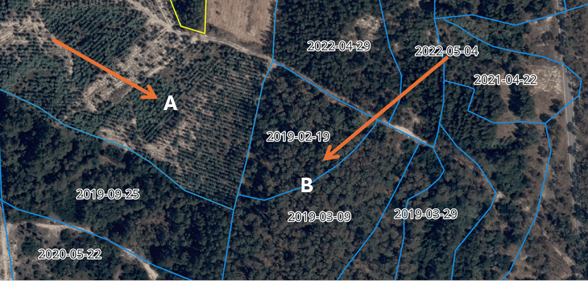
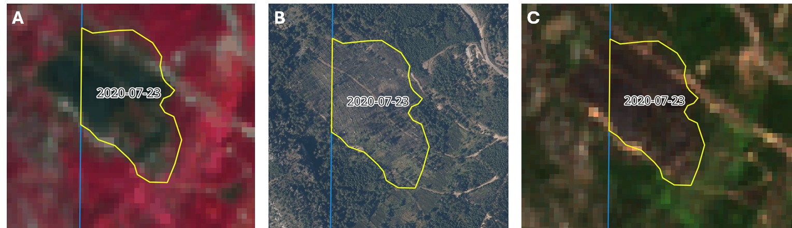
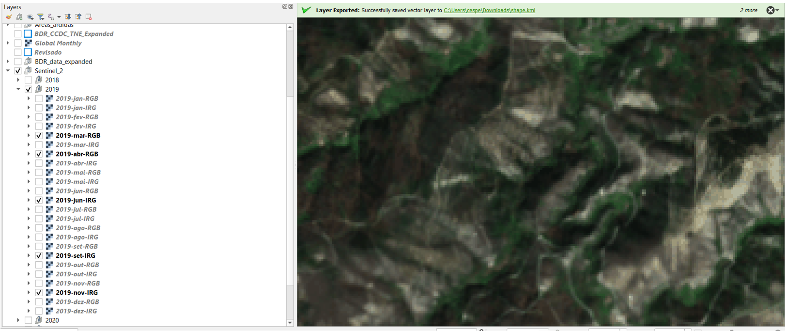
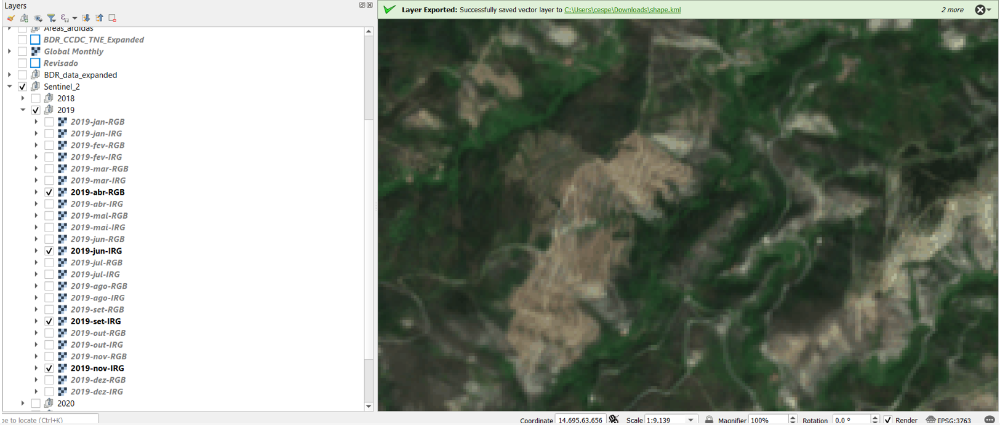
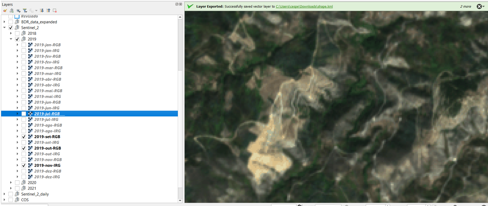
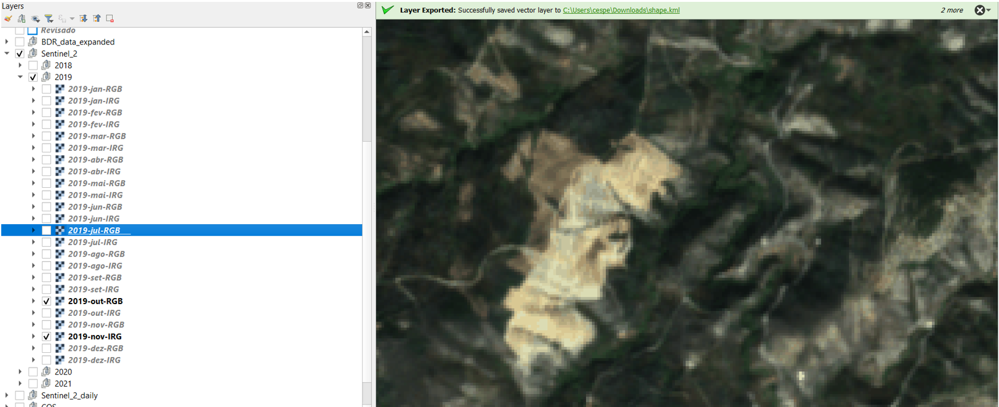
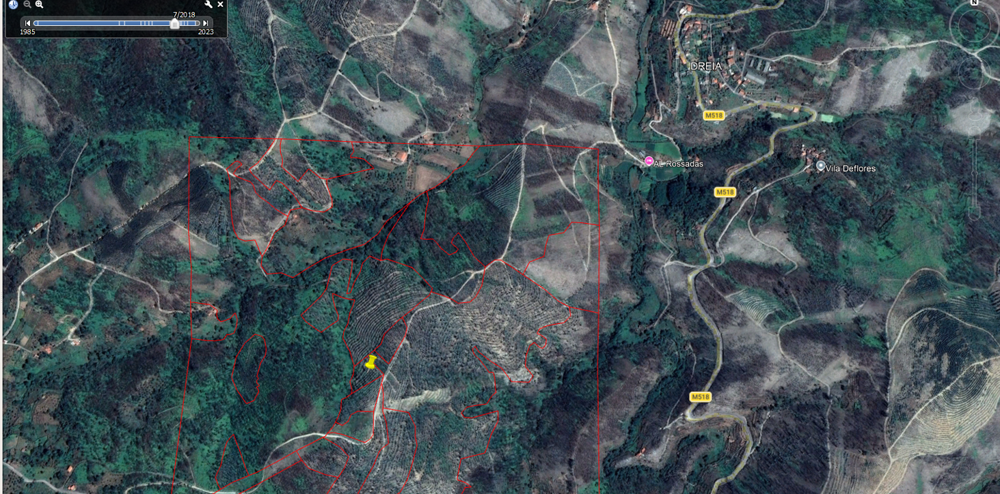
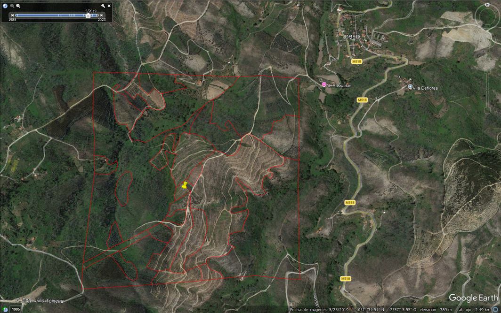

# BDR-TNE-300-Expanded – Detailed Processing and Photointerpretation Workflow

This document describes the methodology and workflow applied to the **BDR-TNE-300-Expanded** dataset. This layer constitutes an expert-based photointerpretation product designed to complement and contextualize the automated disturbance detection results derived from `BDR_CCDC_TNE_v3`.

The dataset is used as a qualitative reference and validation-support layer within the harmonization framework. Unlike the standard BDR layer, BDR-TNE-300-Expanded includes a central manual photointerpretation stage followed by a separate automated harmonization runner.

Main interpreted and revised layer:

```text
Results/Topologia_revisado/Cleaned_1.shp
```

Final harmonized output:

```text
Results/Harmonizacion_datos/BDR_expanded.gpkg
```

---

## 1. Scope and role in the project

The BDR-TNE-300-Expanded dataset constitutes a targeted extension of the BDR-TNE-300 reference layer, developed to support a detailed visual assessment of vegetation-cover changes beyond the immediate vicinity of the original 300 m sampling buffers.

While `BDR_CCDC_TNE_v3` provides algorithm-based change detection, BDR-TNE-300-Expanded introduces expert photointerpretation to:

- improve contextual understanding;
- validate ambiguous cases;
- refine disturbance timing;
- classify the disturbance process;
- attribute pre-change and post-change land-cover classes;
- document limitations of automated approaches.

This dataset is not intended to function as a standalone wall-to-wall disturbance map. Instead, it provides qualitative validation, temporal refinement, and interpretative support for the harmonized reference data used in the project.

---

## 2. Repository organization

Within the current `BDR_DGT_300` structure, the main components relevant to BDR expanded are:

```text
BDR_DGT_300/
├── Codes/
│   ├── pipelines/
│   │   ├── BDR_expanded_proposal_extra.py
│   │   └── process_layer_BDR.py
│   ├── runners/
│   │   └── run_process_layer_BDR_expanded.py
│   └── utils/
│       └── normalize_string.py
├── DataIntermediate/
│   ├── cuadros_seleccionados.gpkg
│   └── cuadros_seleccionados_solo_cuadro.gpkg
├── Results/
│   ├── Revisado.shp
│   ├── Topologia_revisado/
│   │   └── Cleaned_1.shp
│   └── Harmonizacion_datos/
│       ├── BDR_expanded.gpkg
│       └── BDR_expanded.xlsx
└── Docs/
    ├── BDR_300.md
    └── BDR_expanded.md
```

The BDR expanded runner determines the project root from its own location. Therefore, it does not depend on an absolute path such as `C:\Users\...` or on the current working directory.

---

## 3. Processing order and execution sequence

The complete BDR-TNE-300-Expanded workflow combines preparatory processing, manual expert interpretation, topology review, and automated harmonization.

The processing order is:

```text
1. Selection and generation of expanded interpretation units
   BDR_expanded_proposal_extra.py
            ↓
2. Manual expert photointerpretation and attribute revision
   Results/Revisado.shp
            ↓
3. Geometry and topology review
   Results/Topologia_revisado/Cleaned_1.shp
            ↓
4. Automated harmonization and final export
   run_process_layer_BDR_expanded.py
```

### 3.1 Stage 1 — Selection and generation of expanded interpretation units

**Pipeline:**

```text
Codes/pipelines/BDR_expanded_proposal_extra.py
```

This stage supports the selection of BDR-TNE-300 buffers and the generation of the 1 km × 1 km analysis squares used for expanded photointerpretation.

Main intermediate outputs include:

```text
DataIntermediate/cuadros_seleccionados.gpkg
DataIntermediate/cuadros_seleccionados_solo_cuadro.gpkg
```

These outputs define the spatial units used in the expert visual-analysis stage.

### 3.2 Stage 2 — Manual expert photointerpretation

The expanded analysis units are reviewed manually using multi-source imagery and ancillary information.

Main working layer:

```text
Results/Revisado.shp
```

This stage defines or revises:

- disturbance presence;
- disturbance type;
- pre-change and post-change dates;
- agreement or disagreement with CCDC;
- interpretation notes;
- orthophoto references;
- pre-change and post-change land-cover classes.

This stage is expert-driven and is not automatically reproduced by the harmonization code.

### 3.3 Stage 3 — Geometry and topology review

Before harmonization, the interpreted layer is geometrically reviewed and cleaned.

Input to the automated harmonization runner:

```text
Results/Topologia_revisado/Cleaned_1.shp
```

This reviewed layer is the authoritative input used by the current BDR expanded runner.

The current BDR expanded automation does not independently regenerate the manual photointerpretation or the topology-cleaned layer. Those stages must be completed before the harmonization runner is executed.

### 3.4 Stage 4 — Harmonization and final export

**Runner:**

```text
Codes/runners/run_process_layer_BDR_expanded.py
```

**Shared pipeline:**

```text
Codes/pipelines/process_layer_BDR.py
```

Command:

```bash
python Codes/runners/run_process_layer_BDR_expanded.py
```

Input:

```text
Results/Topologia_revisado/Cleaned_1.shp
```

Outputs:

```text
Results/Harmonizacion_datos/BDR_expanded.gpkg
Results/Harmonizacion_datos/BDR_expanded.xlsx
```

The runner calls the shared `harmonize_bdr_layer()` function using the BDR expanded layer name. This causes the output to receive:

```text
Src = bdr_expanded
Uid = bdr_expanded_XXXXXXX
```

Although BDR and BDR expanded share the same harmonization function, they have separate runners, separate inputs, separate outputs, and different source identifiers.

---

## 4. Input data and spatial design

### 4.1 Base dataset

BDR-TNE-300-Expanded is derived from the original **BDR-TNE-300** dataset.

The base layer did not originally include explicit temporal interval fields (`Data_0`, `Data_1`) for all features. This motivated further expert interpretation using all available image sources.

### 4.2 Spatial expansion

To enlarge the spatial context available for interpretation, square analysis units of **1 km × 1 km** were generated and centered on a selected subset of BDR-TNE-300 buffers.

These squares define the spatial extent of the expanded dataset and serve as the units for detailed visual analysis.

The selection followed a stratified strategy intended to prioritize interpretable situations. Buffers with an intermediate proportion of altered area—approximately 25–75% classified as `Alteração`—were considered, and a random subset was selected for detailed analysis.

---

## 5. Photointerpretation workflow

The areas covered by the 1 km × 1 km squares were systematically analyzed through a dedicated photointerpretation process.

The objective was to identify, characterize, and temporally constrain vegetation-cover changes that may not be fully or unambiguously captured by automated detection methods alone.

### 5.1 Visual data sources

The photointerpretation was based on the combined use of:

- multi-temporal Sentinel-2 imagery;
- monthly Sentinel-2 mosaic products accessed through a Portuguese institutional WMS service;
- high-resolution orthomosaics, including Orto2018, Orto2021 and Orto2023;
- COS land-cover maps;
- ancillary burned-area information from ICNF;
- CCD/CCDC data products generated within the project;
- Google Earth imagery when required for independent visual confirmation.

### 5.2 Identification and dating of changes

For each interpretation unit, the following steps were performed:

- identification of vegetation-cover change occurrence;
- inspection of all available cloud-free Sentinel-2 scenes around the suspected change period;
- identification of the last image before the change (`Data_0`);
- identification of the first image after the change (`Data_1`);
- refinement of the temporal interval using all available imagery;
- interpretation of the disturbance process;
- attribution of pre-change and post-change land-cover classes.

### 5.3 Comparison with CCDC results

The photointerpretation explicitly assessed the correspondence between visually interpreted changes and the dates suggested by the CCDC algorithm.

Each case was flagged to indicate whether the CCDC result was considered consistent with the visual evidence.

It is important to note that BDR-TNE-300-Expanded is not generated exclusively through automated processing. The core interpretation stage is manual and expert-driven. The code-based workflow supports the generation of candidate units and the final harmonization and export of the interpreted layer.

---

## 6. Attributes in the reviewed photointerpretation layer

This section describes the principal fields found in the manually reviewed BDR-TNE-300-Expanded layer before harmonization.

### fid

- **Type:** integer
- **Description:** Internal feature identifier generated by the GIS environment.
- **Note:** Not used as the final harmonized identifier.

### ID

- **Type:** integer
- **Description:** Identifier of the expanded interpretation unit.
- **Purpose:** Links the interpreted polygon to the BDR sampling and interpretation framework.

### buffer_ID

- **Type:** integer or string
- **Description:** Identifier of the original 300 m buffer from which the expanded square was generated.
- **Purpose:** Maintains traceability to the original BDR-TNE-300 reference unit.

### Notas

- **Type:** string
- **Description:** Expert interpretation notes, uncertainties, adjustments, or contextual observations.
- **Examples:** partial cuts, vegetation regrowth, fire influence, ambiguity in disturbance timing.
- **Purpose:** Documents the interpretation rationale.

### Orto

- **Type:** string
- **Description:** Orthophoto or orthomosaic used to confirm or interpret the disturbance.
- **Example:** `Orto 2021`.

### CCD

- **Type:** string
- **Description:** Indicates whether the CCDC date agrees with the expert interpretation.
- **Typical values:**
  - `Sim`
  - `Não`

### Data

- **Type:** date or NULL
- **Description:** Legacy single-date representation retained for traceability.
- **Note:** Superseded by `Data_0` and `Data_1`.

### Data_0

- **Type:** date or NULL
- **Description:** Date of the last Sentinel-2 image before the interpreted disturbance.

### Data_1

- **Type:** date or NULL
- **Description:** Date of the first Sentinel-2 image after the interpreted disturbance.

### Change

- **Type:** string
- **Description:** Indicates whether a vegetation-cover change was identified.

### area_ha

- **Type:** float
- **Description:** Area of the interpreted polygon in hectares.
- **Note:** The harmonization pipeline recalculates the final `Area_ha` from geometry.

### tipo_1

- **Type:** string
- **Description:** Expert-interpreted disturbance type.
- **Typical values:**
  - `Corte`
  - `Fogo`
  - `Outro`

### clase_0

- **Type:** string
- **Description:** Land-cover class before the disturbance.

### clase_1

- **Type:** string
- **Description:** Land-cover class after the disturbance.

---

## 7. Harmonization rules and final output fields

The current BDR expanded runner uses the same harmonization function as the standard BDR workflow, but identifies the layer as `bdr_expanded`.

The final harmonized schema is:

```text
Src
Id
Uid
Data0
Data1
Temp_eval_start
Temp_eval_end
Chg_type
Area_ha
Validation_flag
Pi_dicofre
S2_tile
Classe_0
Classe_1
Buffer_id
geometry
```

### 7.1 Src

- **Type:** string
- **Value:** `bdr_expanded`
- **Purpose:** Distinguishes BDR expanded from BDR, ICNF and NVG.

### 7.2 Id

- **Type:** integer
- **Description:** Sequential identifier created during harmonization.

### 7.3 Uid

- **Type:** string
- **Format:** `bdr_expanded_XXXXXXX`
- **Purpose:** Provides a source-specific unique identifier.

### 7.4 Data0

- **Type:** date string (`YYYY-MM-DD`) or NULL
- **Description:** Standardized start date of the interpreted disturbance interval.
- **Accepted source fields:**

```text
data_0
Data_0
DATA_0
Data0
DATA0
```

### 7.5 Data1

- **Type:** date string (`YYYY-MM-DD`) or NULL
- **Description:** Standardized end date of the interpreted disturbance interval.
- **Accepted source fields:**

```text
data_1
Data_1
DATA_1
Data1
DATA1
```

The date parser supports date, datetime, Pandas Timestamp, `YYYY-MM-DD`, datetime strings, and `YYYYMMDD` values.

### 7.6 Temp_eval_start

- **Type:** date string (`YYYY-MM-DD`)
- **Current value:** `2018-09-01`
- **Description:** Fixed start of the project-wide evaluation period.

### 7.7 Temp_eval_end

- **Type:** date string (`YYYY-MM-DD`)
- **Current value:** `2021-09-30`
- **Description:** Fixed end of the project-wide evaluation period.

In the current implementation, these two fields are constants assigned to every record. They are not calculated as `max(Data0, global start)` or `min(Data1, global end)`.

### 7.8 Chg_type

- **Type:** string or NULL
- **Description:** Harmonized disturbance type derived from `tipo_1` and the available change indicator.

For BDR expanded, the pipeline normally evaluates `Change` when `altera` is not available.

Values containing `change` are treated as disturbance records, except those containing:

```text
no change
not aplicable
not applicable
```

### 7.9 Area_ha

- **Type:** float
- **Description:** Polygon area recalculated from geometry.

```text
Area_ha = geometry area / 10,000
```

### 7.10 Validation_flag

- **Type:** string
- **Final values:**
  - `topology error`
  - `no topology error`

The field is recalculated during harmonization using polygonized boundaries and coverage counts.

A feature is flagged when it:

- participates in an overlap; or
- touches an internal gap.

The calculation does not modify the geometry.

### 7.11 Pi_dicofre

- **Type:** string or NULL
- **Description:** Administrative code derived from `dtmnfr`.
- **Reference layer:**

```text
NUTS/areas_administrativas.shp
```

The assignment is performed using polygon centroids.

### 7.12 S2_tile

- **Type:** string or NULL
- **Description:** Sentinel-2 tile assigned only when the complete polygon falls within one unique tile.
- **Reference layer:**

```text
S2_tiles/sentinel2_tiles_PT_terra_tm06.shp
```

Rules:

- exactly one complete `within` match → tile assigned;
- no complete match → NULL;
- more than one match → NULL.

Final tile values are normalized to lowercase:

```text
T29TNE → t29tne
```

### 7.13 Classe_0

- **Type:** string or NULL
- **Description:** Harmonized pre-disturbance class.
- **Accepted source variants:**

```text
classe_0
clase_0
Classe_0
Clase_0
```

Final values are converted to lowercase and accents are removed.

### 7.14 Classe_1

- **Type:** string or NULL
- **Description:** Harmonized post-disturbance class.
- **Accepted source variants:**

```text
classe_1
clase_1
Classe_1
Clase_1
```

Final values are converted to lowercase and accents are removed.

### 7.15 Buffer_id

- **Type:** string or NULL
- **Description:** Cleaned identifier of the original BDR buffer.

Cleaning rules include:

- NULL-like values remain NULL;
- empty strings become NULL;
- `123.0` becomes `123`.

---

## 8. Final text normalization

The harmonization pipeline applies final text normalization after constructing the harmonized fields.

The corrected implementation recognizes:

```text
object
string[python]
string[pyarrow]
```

It normalizes every text value individually by:

- converting it to lowercase;
- removing accents and diacritics;
- trimming surrounding spaces;
- preserving NULL values.

The following date fields are explicitly excluded:

```text
Data0
Data1
Temp_eval_start
Temp_eval_end
```

Examples:

```text
T29TNE               → t29tne
Eucalipto            → eucalipto
Pinheiro bravo       → pinheiro bravo
Superfície sem ...   → superficie sem ...
```

The field names themselves retain the harmonized naming convention, including `S2_tile`, `Classe_0`, and `Classe_1`.

Relevant code:

```text
Codes/pipelines/process_layer_BDR.py
Codes/utils/normalize_string.py
```

---

## 9. Relationship with BDR and the harmonization framework

BDR-TNE-300-Expanded complements `BDR_CCDC_TNE_v3` by providing expert-based validation and temporal refinement.

Its principal roles are to:

- explain discrepancies between visual evidence and automated detections;
- provide examples of multi-stage disturbances;
- refine pre-change and post-change dates;
- improve thematic interpretation;
- support qualitative validation of CCDC;
- provide contextual reference cases for the integrated harmonization framework.

Although BDR and BDR expanded use the same shared harmonization pipeline, they remain separate products:

| Component | BDR | BDR expanded |
|---|---|---|
| Main source | Automated/reference BDR layer | Expert-interpreted expanded layer |
| Runner | `run_process_layer_BDR.py` | `run_process_layer_BDR_expanded.py` |
| Source value | `bdr` | `bdr_expanded` |
| UID prefix | `bdr_` | `bdr_expanded_` |
| Final GeoPackage | `BDR_CCDC_TNE_v3_harmonized.gpkg` | `BDR_expanded.gpkg` |

---

## 10. Design decisions and limitations

### 10.1 Example of photointerpretation for land-cover class attribution



*Figure 1. Example of expert photointerpretation used to discriminate land-cover classes within the BDR-TNE-300-Expanded dataset. Area **A** corresponds to eucalyptus, while area **B** corresponds to maritime pine (`Pinheiro bravo`). Dates indicate the temporal context of observed changes.*

Figure 1 illustrates two adjacent areas, labelled **A** and **B**, which exhibit different spatial patterns, canopy structures, and temporal trajectories despite being located within the same expanded analysis unit.

- **Area A – Eucalyptus plantation**  
  This area is characterized by a regular planting pattern, homogeneous row spacing, and a relatively uniform canopy texture. Temporal inspection of Sentinel-2 imagery shows rapid spectral change following clear-cutting and a fast regrowth signal, consistent with short-rotation eucalyptus management.

- **Area B – Pinheiro bravo (maritime pine)**  
  This area presents a more irregular canopy structure and heterogeneous spacing between trees. The temporal sequence indicates a slower vegetation response after disturbance, with spectral characteristics and regrowth dynamics typical of pine stands.

The distinction between these classes was supported by:

- multi-temporal Sentinel-2 imagery;
- monthly Sentinel-2 mosaics;
- high-resolution orthophotos;
- COS land-cover maps.

This example highlights the importance of expert visual interpretation when automated methods detect a disturbance but cannot reliably distinguish between forest types.

The corresponding reviewed input fields are:

```text
clase_0
clase_1
```

They are exported in the harmonized output as:

```text
Classe_0
Classe_1
```

### 10.2 Example of photointerpretation for burned-area classification



*Figure 2. Example of burned-area classification using multiple image sources. Panel **A** shows the monthly Sentinel-2 mosaic for August 2020, panel **B** shows the 2021 orthomosaic, and panel **C** shows the individual Sentinel-2 scene corresponding to the labelled date.*

This example combines complementary sources to identify and confirm a burned-area event.

- **Panel A – Monthly Sentinel-2 mosaic (August 2020)**  
  The mosaic highlights a clear spectral anomaly consistent with recent fire disturbance.

- **Panel B – Orthomosaic (2021)**  
  The high-resolution orthomosaic enables detailed inspection of canopy loss, charred textures, and structural damage.

- **Panel C – Individual Sentinel-2 scene**  
  The individual scene provides temporal precision for assigning `Data_0` and `Data_1`.

The integration of these sources enabled:

- confirmation of the disturbance as fire (`Fogo`);
- refinement of the change interval;
- validation or correction of CCDC;
- documentation of the interpretation in `CCD` and `Notas`.

### 10.3 Main limitations

The principal limitations are:

- partial spatial coverage;
- expert-based subjectivity;
- dependence on availability of cloud-free imagery;
- dependence on temporal coverage of orthophotos and Google Earth imagery;
- possible disagreement between the first visible onset and the strongest CCDC break;
- non-automatic generation of the interpreted reference layer.

---

## 11. Special case — Buffer ID 94

- **Location:** Benfeita, Arganil, Coimbra
- **Coordinates:** EPSG:3763 — `14985.9 E, 63676.9 N`

### 11.1 Change timing: CCDC vs. visual interpretation

Buffer ID **94** is representative of several similar cases, including buffer **132**.

The CCDC output indicates that the disturbance occurs in **September**, while visual inspection shows that the actual onset occurs earlier, between **March and April**.

### 11.2 Evidence from imagery



*Figure 3. Baseline condition for buffer ID 94 before the detected disturbance. The scene represents the pre-change state in March.*



*Figure 4. Early change observed between March and April. The figure supports that the disturbance onset precedes the CCDC break date.*

### 11.3 Strong disturbance after land preparation

After the initial change, the area was ploughed, cleared, or otherwise prepared, producing a stronger signal later in the year.



*Figure 5. Strong spectral and visual disturbance in September. Although CCDC places the break here, this likely reflects a later and stronger phase of the process rather than the initial onset.*



*Figure 6. Post-preparation condition in October, showing a consolidated post-disturbance state.*

### 11.4 Why the CCDC date can be misleading

Because CCDC may report the last or strongest detected break, the apparent date can shift to September.

If this date is interpreted as the start of the disturbance, it produces a temporal interpretation error, because the initial onset is visible earlier, between March and April.

### 11.5 Independent validation with Google Earth

Google Earth imagery independently confirms that the transition occurred before September.



*Figure 7. Google Earth view from July 2018 showing the pre-change condition.*



*Figure 8. Google Earth view from May 2019 showing a clear change relative to July 2018. This evidence guided the Sentinel-2 scene search toward the March–April interval.*

---

## 12. Final outputs

The current BDR expanded harmonization stage produces:

```text
Results/Harmonizacion_datos/BDR_expanded.gpkg
Results/Harmonizacion_datos/BDR_expanded.xlsx
```

The GeoPackage is the final harmonized spatial product.

The Excel file documents field-name traceability using:

```text
original_name
final_name
status
```

Possible status values include:

```text
kept_and_renamed
dropped
added
```

---

## 13. Status

The BDR-TNE-300-Expanded dataset has been:

1. spatially expanded from selected BDR-TNE-300 units;
2. manually photointerpreted;
3. revised and topologically cleaned;
4. harmonized through its independent runner;
5. exported as a source-specific GeoPackage and field-mapping report.

The final harmonized product is:

```text
Results/Harmonizacion_datos/BDR_expanded.gpkg
```

The harmonized field definitions and shared transformation rules should be read together with `BDR_300.md`, while the present document records the layer-specific spatial design, manual photointerpretation process, execution order, examples, and limitations.
