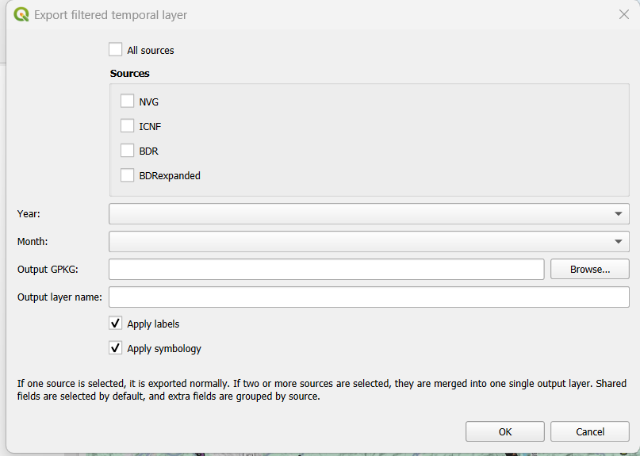
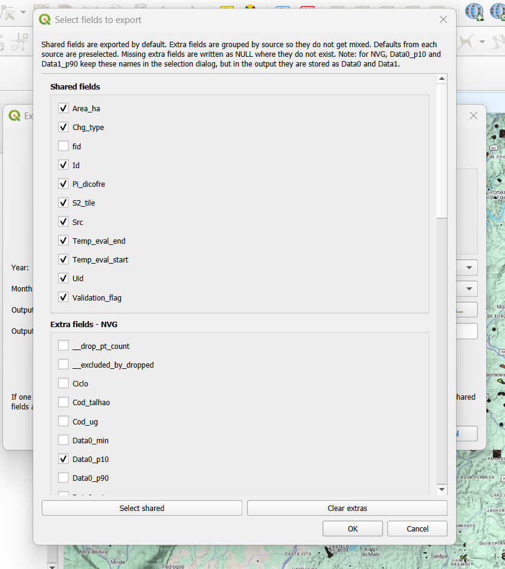
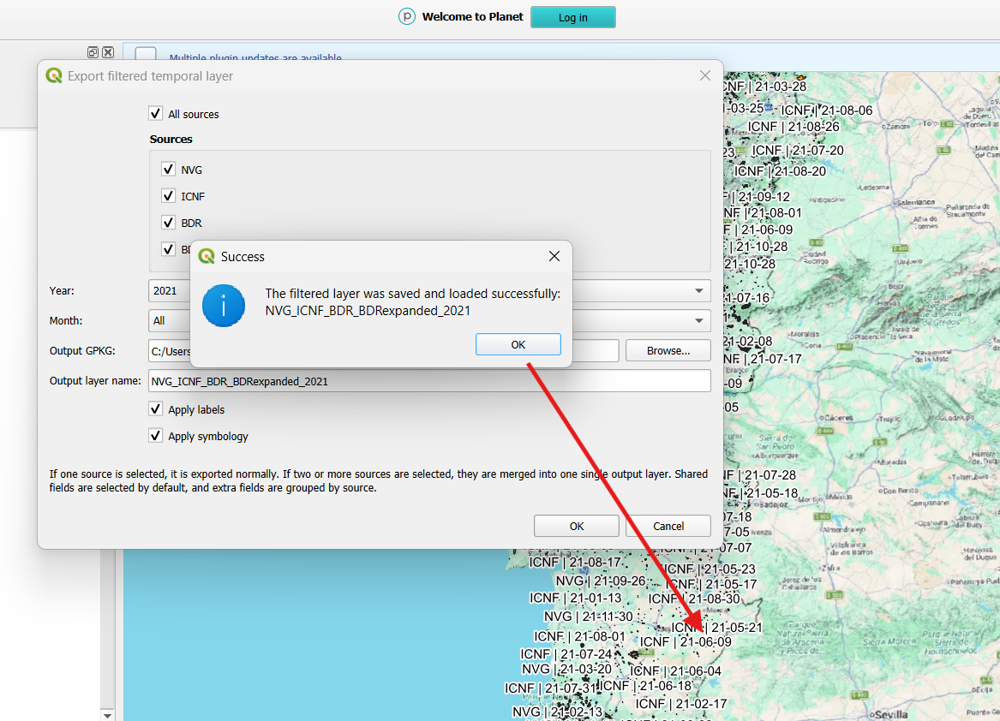
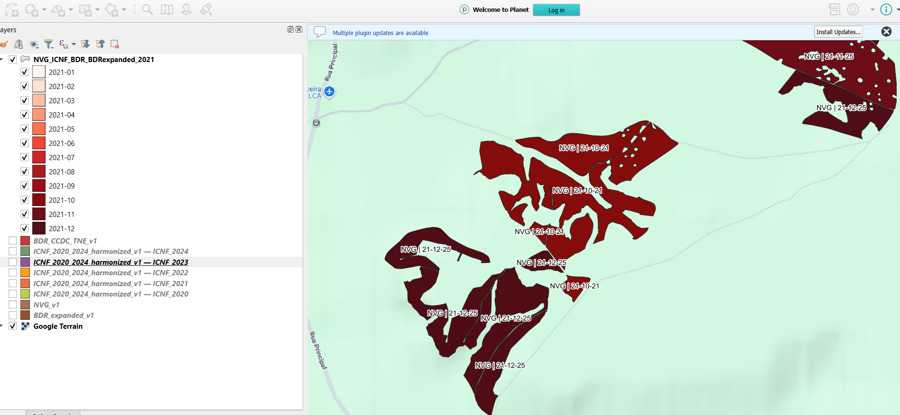

# Harmonized Data Export – Detailed QGIS Workflow

This document describes the organization and use of the tools developed to select, filter, combine, and export information from the harmonized **BDR**, **BDR Expanded**, **NVG**, and **ICNF** reference datasets.

The principal component is `export_data_generation.py`, which provides an interactive QGIS dialog for selecting sources, temporal periods, output fields, and the destination GeoPackage. The folder also includes `merge_harmonized_layers.py`, an optional batch utility that concatenates the harmonized source layers into a single GeoPackage.

---

## 1. Scope and purpose

The export workflow is applied after the source-specific harmonization processes have been completed. It does not modify the original BDR, BDR Expanded, NVG, or ICNF processing pipelines.

Its main objectives are to:

- use the final harmonized layers as input data;
- select one or more reference sources;
- inspect the years and months available in the selected sources;
- filter features by year and, optionally, by month;
- select the attributes that must be retained;
- standardize the NVG temporal fields during export;
- export one source or several sources to a GeoPackage layer;
- optionally apply temporal symbology and labels in QGIS;
- provide a separate batch utility for producing a complete merged harmonized layer.

The exported layers are intended as task-specific subsets of the harmonized reference datasets. They can therefore be smaller and more focused than the complete harmonized source layers.

---

## 2. Project organization

The workflow and the suggested folder organization is next:

```text
Export_generation/
├── Codes (https://github.com/S2change/vegetation_loss/tree/main/scripts/ref_datasets/Export_generation/Codes)/
│   ├── pipelines/
│   │   ├── export_data_generation.py
│   │   ├── merge_harmonized_layers.py
│   │   └── __init__.py
│   └── runners/
│       ├── run_merge_harmonized_layers.py
│       └── __init__.py
├── Data (DGT-S2CHANGE_2023/partihaldo/ref__datasets/harmonized/Export_generation/Data)/
│   ├── BDR_CCDC_TNE_v1.gpkg
│   ├── BDR_expanded_v1.gpkg
│   ├── NVG_v1.gpkg
│   └── ICNF_2020_2024_harmonized_v1.gpkg
├── QGIS (DGT-S2CHANGE_2023/partihaldo/ref__datasets/harmonized/Export_generation/QGIS)/
│   └── Export_data_generation.qgz
├── Results (DGT-S2CHANGE_2023/partihaldo/ref__datasets/harmonized/Export_generation/Results)/
│   ├── Merged_harmonized_layers/
│   └── Exported_data/
└── Docs/
    ├── Export_data_generation.md
    └── Images/
        ├── README.md
        ├── figure_1.png
        ├── figure_2.png
        ├── figure_3.png
        └── figure_4.png
```

The folder roles are:

- `Codes/pipelines/`: processing implementations;
- `Codes/runners/`: executable entry points for non-interactive workflows;
- `Data/`: final harmonized layers produced by the source-specific workflows;
- `Results/Merged_harmonized_layers/`: output of the optional complete merge;
- `Results/Exported_data/`: recommended destination for filtered exports created from QGIS;
- `Docs/`: technical documentation;
- `Docs/Images/`: figures illustrating the QGIS export workflow and its outputs.

The harmonized inputs originate from the following source-specific results:

```text
BDR_and_BDR_expanded/Results/Harmonizacion_datos/BDR_CCDC_TNE_v1.gpkg
BDR_and_BDR_expanded/Results/Harmonizacion_datos/BDR_expanded_v1.gpkg
NVG/Results/Harmonizacion_datos/NVG_propios_split_by_harmonized_keep_propios.gpkg
ICNF/Results/Harmonizacion_datos/ICNF_2020_2024_harmonized.gpkg
```

For this export folder, copies of those final products are placed under `Data/` using the filenames shown in the folder tree.

---

## 3. Workflow components

### 3.1 Interactive filtered export

The main export tool is:

`Codes/pipelines/export_data_generation.py`

This script is designed to run inside the QGIS Python environment. When executed, it opens the dialog:

```text
Export filtered temporal layer
```

The dialog controls:

- source selection;
- year selection;
- month selection;
- destination GeoPackage;
- output layer name;
- field selection;
- optional labels;
- optional temporal symbology.

The tool operates on harmonized vector layers that are already loaded in the active QGIS project. It does not automatically read every file stored in `Data/`.

### 3.2 Optional complete merge

The complete merge is implemented in:

`Codes/pipelines/merge_harmonized_layers.py`

and executed through:

`Codes/runners/run_merge_harmonized_layers.py`

This utility reads the harmonized source layers from `Data/`, aligns their attribute schemas, concatenates all features, adds a source-identification field, and writes one complete GeoPackage layer.

The output is:

`Results/Merged_harmonized_layers/all_harmonized_merged.gpkg`

with the layer:

`all_harmonized_merged`

This merge is independent of the interactive export tool. Running it is not required before using `export_data_generation.py`.

---

## 4. Required harmonized inputs

The organized runner expects the following files.

### BDR

```text
Data/BDR_CCDC_TNE_v1.gpkg
```

Expected layer:

```text
BDR_CCDC_TNE_v1
```

### BDR Expanded

```text
Data/BDR_expanded_v1.gpkg
```

QGIS layer name:

```text
BDR expanded v1
```

Equivalent names using underscores or other separators, such as `BDR_expanded_v1`, are also recognized.

### NVG

```text
Data/NVG_propios_split_by_harmonized_keep_propios.gpkg
```

QGIS layer name:

```text
NVG_v1
```

### ICNF

```text
Data/ICNF_2020_2024_harmonized.gpkg
```

QGIS display names:

```text
ICNF_2020_2024_harmonized_v1 — ICNF_2020
ICNF_2020_2024_harmonized_v1 — ICNF_2021
ICNF_2020_2024_harmonized_v1 — ICNF_2022
ICNF_2020_2024_harmonized_v1 — ICNF_2023
ICNF_2020_2024_harmonized_v1 — ICNF_2024
```

The five annual layers are classified as a single source, `ICNF`, by the interactive QGIS tool.

In the current merge runner, `layer=None` is used for ICNF. Consequently, GeoPandas reads the default or first layer of the GeoPackage. If the ICNF GeoPackage contains several annual layers, this behavior must be considered when preparing the input used by the complete merge.

---

## 5. Processing order

### 5.1 Prepare the export workspace

Copy the final harmonized outputs from the source-specific folders into:

`Data/`

No raw or intermediate source data are required in this folder.

### 5.2 Optional: create the complete merged harmonized layer

Run from the root of `Export_generation_organizado`:

```text
python Codes/runners/run_merge_harmonized_layers.py
```

The runner reads the four configured inputs and writes:

```text
Results/Merged_harmonized_layers/all_harmonized_merged.gpkg
```

This stage is useful when a complete concatenated version of the harmonized reference datasets is required.

### 5.3 Load the harmonized source layers in QGIS

For interactive filtered export, load the required harmonized source layers from `Data/` into the active QGIS project.

The layer names must allow the script to classify the sources correctly. The current detection is case-insensitive and normalizes spaces, underscores, hyphens, and long dashes.

The operational rules are:

- names containing `BDR_CCDC_TNE` are classified as `BDR`;
- names equivalent to `BDR expanded` or `BDR_expanded` are classified as `BDRexpanded`;
- names containing `ICNF_2020_2024_harmonized` are classified as `ICNF`;
- names equal to or beginning with `NVG` are classified as `NVG`.

The following QGIS display names are recognized directly:

```text
BDR_CCDC_TNE_v1
BDR expanded v1
NVG_v1
ICNF_2020_2024_harmonized_v1 — ICNF_2020
ICNF_2020_2024_harmonized_v1 — ICNF_2021
ICNF_2020_2024_harmonized_v1 — ICNF_2022
ICNF_2020_2024_harmonized_v1 — ICNF_2023
ICNF_2020_2024_harmonized_v1 — ICNF_2024
```

The classification is based on the QGIS display name. If a layer is renamed substantially, it may no longer be detected.

### 5.4 Run the interactive export tool in QGIS

Execute:

`Codes/pipelines/export_data_generation.py`

from the QGIS Python editor or another QGIS Python execution environment.

The script opens the export dialog automatically.



**Figure 1.** Initial `Export filtered temporal layer` dialog. The user can select one or more harmonized sources, choose the year and month, define the destination GeoPackage and output layer name, and decide whether labels and symbology should be applied.

### 5.5 Select the export configuration

In the dialog:

1. select one source, several sources, or `All sources`;
2. select a year or `All`;
3. select a month or `All`;
4. choose the output GeoPackage;
5. optionally define an output layer name;
6. select the fields to retain;
7. choose whether labels and symbology should be applied;
8. confirm the export.

After the main configuration is accepted, the script opens a second dialog for selecting output fields.



**Figure 2.** Multi-source field-selection dialog. Fields available in every selected source are listed under `Shared fields`, while source-specific fields are grouped separately, such as `Extra fields - NVG`.

In the illustrated example, the common harmonized fields are preselected, including `Area_ha`, `Chg_type`, `Id`, `Pi_dicofre`, `S2_tile`, `Src`, `Temp_eval_start`, `Temp_eval_end`, `Uid`, and `Validation_flag`. The field `fid` remains available but is not selected by default. NVG-specific fields such as `Data0_p10` are retained in the NVG group.

The recommended output location is:

`Results/Exported_data/`

The output location is selected interactively and is not hard-coded by `export_data_generation.py`.

---

### 5.6 Confirm and inspect the exported layer

After the selected fields are accepted, the script:

1. creates a temporary memory layer;
2. filters features by source, year, and month;
3. copies the selected attributes and geometries;
4. standardizes the NVG temporal field names;
5. creates `label_txt`;
6. creates `time_code` for a multi-source output;
7. writes the result to the selected GeoPackage;
8. loads the saved layer into QGIS;
9. applies labels and symbology when those options are enabled;
10. displays a success message.



**Figure 3.** Successful multi-source export for 2021. The output layer `NVG_ICNF_BDR_BDRexpanded_2021` was saved and loaded into QGIS. The visible labels combine the source identifier and feature date.

The resulting layer is immediately available for inspection in the QGIS Layers panel and map canvas.



**Figure 4.** Final combined output for 2021. The exported layer contains features from NVG, ICNF, BDR, and BDR Expanded, uses monthly categories from `2021-01` to `2021-12`, and displays labels such as `NVG | 21-10-21`.

The illustrated result confirms that the workflow:

- combines the selected sources into one output layer;
- preserves source identity through the selected fields and labels;
- applies the selected annual filter;
- creates monthly temporal categories;
- applies the requested labels and symbology;
- keeps the original harmonized input layers unchanged in the QGIS project.

---

## 6. Source detection and temporal fields

The supported sources are defined as:

```text
NVG
ICNF
BDR
BDRexpanded
```

The temporal field used to identify available years and months and to filter the features depends on the source:

| Source | Temporal field used for filtering |
|---|---|
| NVG | `Data0_p10` |
| ICNF | `Data0` |
| BDR | `Data0` |
| BDRexpanded | `Data0` |


When `All` is selected for the year, all features with a recognizable year are eligible. When `All` is selected for the month, all recognizable months within the selected year are retained.

Features whose selected temporal value is NULL, empty, or cannot be interpreted as a year are excluded from the filtered export.

---

## 7. Field selection

After the temporal options are selected, the script opens a field-selection dialog.

### 7.1 Default fields

When available, the following common fields are selected by default:

```text
Id
Src
Uid
Chg_type
Pi_dicofre
Temp_eval_start
Temp_eval_end
Validation_flag
Area_ha
```

For BDR, BDR Expanded, and ICNF, the default temporal fields are:

```text
Data0
Data1
```

For NVG, the default temporal fields are:

```text
Data0_p10
Data1_p90
```

### 7.2 NVG temporal-field standardization

During the export, the NVG temporal fields are written using the common output names:

```text
Data0_p10 → Data0
Data1_p90 → Data1
```

This renaming is limited to the exported output. It does not modify the harmonized NVG source layer.

### 7.3 Single-source export

When one source is selected:

- all available fields from that source are shown;
- the default common and temporal fields are preselected;
- the temporal field required for filtering remains selected;
- the selected records are written to one output layer.

### 7.4 Multi-source export

When two or more sources are selected:

- fields present in all selected sources are shown as shared fields;
- fields present only in some sources are grouped as extra fields by source;
- shared fields are selected by default where appropriate;
- selected extra fields are retained;
- missing extra fields are written as NULL for sources where they do not exist;
- all matching records are appended to a single output layer.

This interactive multi-source export is different from `merge_harmonized_layers.py`. The interactive tool filters the selected records and fields before creating the output, while the merge utility produces a complete batch concatenation of the configured harmonized inputs.

---

## 8. Output construction

The export is first created as a temporary QGIS memory layer and is then written to the selected GeoPackage.

### 8.1 Geometry and CRS

The output geometry type and CRS are obtained from the first valid source layer detected for the export.

The script does not reproject the selected layers during export. Therefore, sources combined in one output should already use a compatible geometry type and the same CRS.

### 8.2 Automatically added fields

Every export contains:

```text
label_txt
```

`label_txt` combines the source name and the temporal value used for filtering. Example:

```text
NVG | 22-11-05
```

A multi-source export also contains:

```text
time_code
```

The field stores a normalized temporal category such as:

```text
2022
2022-11
```

and is used by the multi-source temporal symbology.

### 8.3 GeoPackage writing behavior

If the selected GeoPackage does not exist, the script creates it.

If the GeoPackage already exists, the script creates or overwrites only the selected output layer. It does not necessarily replace the complete GeoPackage.

After writing, the output layer is reloaded into the active QGIS project.

If no output layer name is entered, the script creates one automatically from the selected sources and temporal filter. Examples include:

```text
NVG_all_years
BDR_2022
NVG_ICNF_2022_11
```

---

## 9. Labels and symbology

### 9.1 Labels

When `Apply labels` is enabled, the script labels the exported layer using:

```text
label_txt
```

The label format uses the source name and a shortened temporal value.

### 9.2 Temporal symbology

When `Apply symbology` is enabled, the script creates categorized temporal symbology.

For single-source exports, the categories are derived from the exported temporal field.

For multi-source exports, the categories are derived from:

```text
time_code
```

Month-based categories use the month color definitions contained in the script. In the 2021 example shown in Figure 4, the final layer contains one category for each month from `2021-01` to `2021-12`. Features without a valid temporal category use the default color.

The symbology and labels are applied to the layer loaded in the current QGIS project. The GeoPackage stores the exported data; persistent QGIS styling depends on how the project or layer style is subsequently saved.

---

## 10. Complete merge behavior

The optional merge pipeline:

`Codes/pipelines/merge_harmonized_layers.py`

performs the following operations:

1. reads the configured harmonized inputs;
2. removes leading and trailing whitespace from non-geometry column names;
3. verifies that the input layers report the same CRS;
4. identifies shared fields case-insensitively;
5. identifies the union of fields when `keep_extra_fields=True`;
6. maps NVG `Data0_p10` and `Data1_p90` to `Data0` and `Data1`;
7. fills fields absent from a source with NULL;
8. adds the field `source_layer`;
9. appends all input features into one GeoDataFrame;
10. writes the result to a GeoPackage.

The organized runner uses:

```text
keep_extra_fields=True
source_field_name=source_layer
```

The merge is an attribute-schema alignment and row concatenation. It is not a spatial union, overlay, intersection, or dissolve operation.

---

## 11. Outputs

### 11.1 Optional complete merged layer

```text
Results/Merged_harmonized_layers/all_harmonized_merged.gpkg
```

Layer:

```text
all_harmonized_merged
```

### 11.2 Filtered exports

Filtered exports are named by the user and should normally be saved under:

```text
Results/Exported_data/
```

A GeoPackage may contain one or several exported layers created during different export sessions.

---

## 12. Status

The export workflow is complete and consists of two related but independent tools:

1. `merge_harmonized_layers.py` for optional complete batch concatenation of the harmonized inputs;
2. `export_data_generation.py` for interactive temporal filtering, field selection, single-source or multi-source export, and optional QGIS visualization.

The central operational tool is `export_data_generation.py`. The organized folder provides the code, expected harmonized inputs, output locations, and documentation required to use the workflow independently from the source-specific processing folders.

The workflow was verified with a multi-source export for 2021 using NVG, ICNF, BDR, and BDR Expanded. The resulting layer was successfully written to a GeoPackage, loaded into QGIS, labeled by source and date, and categorized by month.
