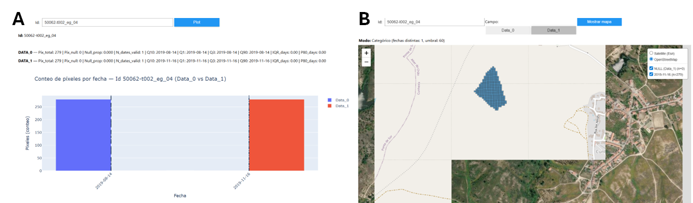
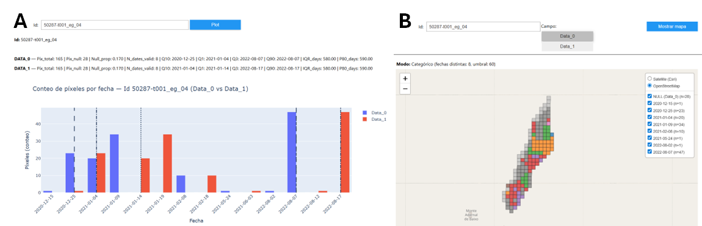
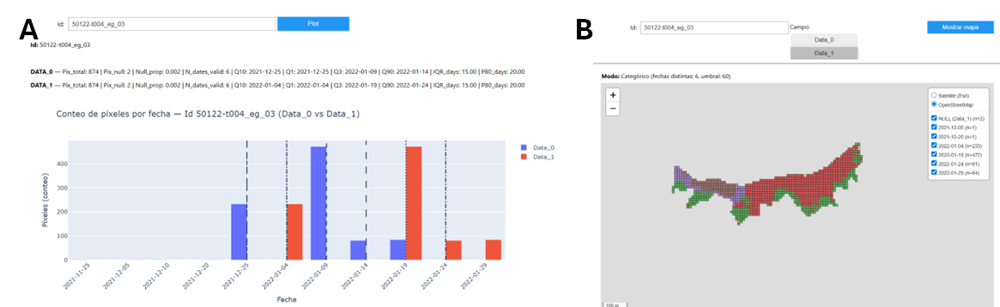

# NVG – Processing Workflow

This document describes the complete processing, validation, harmonization, and final integration workflow applied to the **NVG (Navigator Vegetation Change)** dataset.

NVG is derived from pixel-level vegetation-change detections obtained from the application of the **CCDC algorithm** to Sentinel-2 time series. The workflow converts the original point detections into 10 m pixel polygons, evaluates temporal and CCDC consistency by sub-parcel (`Id`), produces harmonized polygons, and integrates the harmonized results with the operational NVG `propios` polygons.

---

## 1. Scope and role of the NVG dataset

The main role of NVG within the project is to provide a spatially detailed and temporally explicit representation of vegetation-change events, particularly clear-cutting, at sub-parcel scale.

Because NVG originates from pixel-level detections, the dataset presents specific processing challenges related to:

- spatial fragmentation;
- temporal dispersion of detected change dates;
- internal heterogeneity within management units;
- NULL or invalid dates;
- differences in CCDC confirmation among pixels belonging to the same `Id`;
- the integration of harmonized Sentinel-2 results with operational `propios` polygons.

---

## 2. Code organization

The NVG processing code is organized into:

- `Codes/pipelines/`: main processing and harmonization workflows;
- `Codes/runners/`: executable scripts used to run each processing stage;
- `Codes/utils/`: supporting utilities, including text normalization;

### 2.1 Project folder structure

NVG follows the same general organization used for BDR and BDR Expanded, with the processing code, source data, generated results, and documentation stored in separate folders.

```text
NVG/
├── Codes(https://github.com/S2change/vegetation_loss/tree/main/scripts/ref_datasets/NVG/Codes)/
│   ├── pipelines/
│   │   ├── buffer_ccd_nvg_propios.py
│   │   ├── NVG_ccdc_confirmation.py
│   │   ├── nvg_points_to_polygons.py
│   │   ├── process_q3_q1_q9_10.py
│   │   └── nvg_join_nvg_propios.py
│   ├── runners/
│   │   ├── run_buffer_ccd_nvg_propios.py
│   │   ├── run_NVG_ccdc_confirmation.py
│   │   ├── run_normalize_string.py
│   │   ├── run_nvg_points_to_polygons.py
│   │   ├── run_q3_q1_q9_q10.py
│   │   ├── run_nvg_join_nvg_propios.py
│   │   └── run_all_NVG.py
│   ├── utils/
│   │   └── normalize_string.py

├── Data(DGT-S2CHANGE_2023/partihaldo/ref__datasets/harmonized/NVG/Data)/
│   ├── ccd_results_all_tiles_visual_analysis_data0_data1.shp
│   ├── NVG_proprios_2015_2023_clean.gpkg
│   ├── NUTS/
│   ├── S2_tiles/
│   └── Legacy_reference/
├── Results(DGT-S2CHANGE_2023/partihaldo/ref__datasets/harmonized/NVG/Results)/
│   ├── NVG_clean_points_by_internal_buffer/
│   ├── CCDC_confirmation/
│   ├── Normalized_text_columns/
│   ├── Pixel_polygons/
│   ├── Harmonizacion_datos/
│   └── Legacy_harmonization/
└── Docs/
    ├── NVG.md
```

The principal project locations are:

- processing code: `scripts/ref_datasets/NVG/Codes/`;
- source and auxiliary data: `DGT-S2CHANGE_2023/partihaldo/ref__datasets/harmonized/NVG/Data/`;
- processing results: `DGT-S2CHANGE_2023/partihaldo/ref__datasets/harmonized/NVG/Results/`;

The `Codes/legacy/` and `Results/Legacy_harmonization/` folders retain previous processing versions and outputs for traceability. They are not part of the current processing order.

The complete workflow can be executed from the project root with:

```powershell
python Codes\runners\run_all_NVG.py
```

The execution order can be checked without running the geoprocessing with:

```powershell
python Codes\runners\run_all_NVG.py --dry-run
```

---

## 3. Processing order

The NVG workflow must be executed in the following order.

### Stage 1 — Spatial cleaning using the internal NVG buffer

**Runner**

`Codes/runners/run_buffer_ccd_nvg_propios.py`

**Main inputs**

- `Data/NVG_proprios_2015_2023_clean.gpkg`
- `Data/ccd_results_all_tiles_visual_analysis_data0_data1.shp`

**Main outputs**

- `Results/NVG_clean_points_by_internal_buffer/points_clean.gpkg`
- `Results/NVG_clean_points_by_internal_buffer/points_dropped.gpkg`
- `Results/NVG_clean_points_by_internal_buffer/nvg_singleparts.gpkg`
- `Results/NVG_clean_points_by_internal_buffer/nvg_internal_masks.gpkg`

The `propios` polygons are converted from multipart to singlepart and an internal buffer is created. CCDC points located within the internal masks are retained in `points_clean.gpkg`; the remaining points are stored in `points_dropped.gpkg` for auditing and for the final matching rules.

### Stage 2 — CCDC confirmation

**Runner**

`Codes/runners/run_NVG_ccdc_confirmation.py`

**Main input**

`Results/NVG_clean_points_by_internal_buffer/points_clean.gpkg`

**Main output**

`Results/CCDC_confirmation/ccd_results_all_tiles_visual_analysis_data0_data1_ccdc_flag.gpkg`

This stage evaluates the CCDC-related fields and creates the `Ccdc_ok` confirmation flag used in the subsequent temporal and validation calculations.

### Stage 3 — Text normalization

**Runner**

`Codes/runners/run_normalize_string.py`

**Main input**

`Results/CCDC_confirmation/ccd_results_all_tiles_visual_analysis_data0_data1_ccdc_flag.gpkg`

**Main output**

`Results/Normalized_text_columns/ccd_results_all_tiles_visual_analysis_data0_data1_ccdc_flag_textnorm.gpkg`

This stage normalizes the text values required by the harmonization workflow while preserving the remaining attribute structure.

### Stage 4 — Conversion from points to Sentinel-2 pixel polygons

**Runner**

`Codes/runners/run_nvg_points_to_polygons.py`

**Main input**

`Results/Normalized_text_columns/ccd_results_all_tiles_visual_analysis_data0_data1_ccdc_flag_textnorm.gpkg`

**Main output**

`Results/Pixel_polygons/NVG_S2_pixels_from_points_all_pixels.gpkg`

Each point is converted into a 10 × 10 m polygon representing a Sentinel-2 pixel. The processing is performed in a projected metric CRS.

### Stage 5 — NVG harmonization, statistics, temporal windows, and dissolve by `Id`

**Runner**

`Codes/runners/run_q3_q1_q9_q10.py`

**Main inputs**

- `Results/Pixel_polygons/NVG_S2_pixels_from_points_all_pixels.gpkg`
- `Data/NUTS/areas_administrativas.shp`

**Main outputs**

- `Results/Harmonizacion_datos/NVG_pixels_clean_with_id_stats_windows_q50_p80_ccdc_dropNC1_2.gpkg`
- `Results/Harmonizacion_datos/NVG_stats_by_id_q1_q3_p10_p90_spans_ccdc_dropNC1_2.csv`
- `Results/Harmonizacion_datos/NVG_validation_report_stats_vs_dissolve.csv`

The output GeoPackage contains:

- `Pixels_con_chk_p10`
- `PorId_dissolve_sin_Data0_Data1`

This stage applies the final NVG filtering rules, assigns `Pi_dicofre`, calculates the statistics and temporal evaluation windows by `Id`, generates CCDC validation fields, validates the calculated statistics, and dissolves the pixel polygons by `Id`.

### Stage 6 — Integration with NVG `propios` and generation of the final harmonized layer

**Runner**

`Codes/runners/run_nvg_join_nvg_propios.py`

**Main inputs**

- `Data/NVG_proprios_2015_2023_clean.gpkg`
- `Results/Harmonizacion_datos/NVG_pixels_clean_with_id_stats_windows_q50_p80_ccdc_dropNC1_2.gpkg`
- `Results/NVG_clean_points_by_internal_buffer/points_dropped.gpkg`
- `Data/S2_tiles/sentinel2_tiles_PT_terra_tm06.shp`

**Main outputs**

- `Results/Harmonizacion_datos/NVG_propios_split_by_harmonized_keep_propios.gpkg`
- `Results/Harmonizacion_datos/NVG_split_keep_propios_validation.csv`

The final GeoPackage contains the intermediate join layers, the dissolved matched and unmatched components, QA layers, and the final `NVG_harmonized` layer.

---

## 4. Initial data preparation and integrity checks

The workflow begins by:

- loading the NVG/CCDC detections and the operational NVG polygons;
- checking geometry validity and CRS consistency;
- converting the operational NVG polygons from multipart to singlepart;
- generating an internal polygon mask;
- separating retained and dropped CCDC points;
- inspecting the attribute structure, number of records, NULL values, and date distributions.

These checks ensure that only spatially consistent detections continue to the harmonization stages while all excluded points remain available for audit and final matching rules.

---

## 5. Exploratory aggregation strategies

Because NVG data are generated at pixel level, several aggregation strategies were evaluated during workflow development to determine how change detections should be summarized at sub-parcel level (`Id`).

The evaluated approaches included:

- aggregation by `Id` and final change date (`Data1`);
- aggregation using both the initial (`Data0`) and final (`Data1`) dates of the detected change interval;
- comparison of different temporal grouping rules;
- dissolution of all valid pixels belonging to the same `Id`.

These analyses were used to reduce artificial spatial fragmentation while preserving the temporal variability required for quality assessment.

---

## 6. Temporal consistency and variability analysis

The final workflow calculates multiple metrics to characterize temporal behavior within each `Id`, including:

- total number of pixels;
- number and proportion of NULL values in `Data0` and `Data1`;
- empirical P10, Q1, Q3, and P90 dates;
- interquartile range in days;
- minimum `Data0`;
- maximum `Data1`;
- total temporal difference between `Data0_min` and `Data1_max`;
- CCDC confirmation ratio;
- the final temporal evaluation window.

These metrics allow the identification of:

- temporally homogeneous sub-parcels;
- heterogeneous or unstable cases;
- sub-parcels with insufficient valid dates;
- potentially ambiguous change intervals;
- cases requiring additional expert review.

---

## 7. Unimodality assessment and dominant-date strategies

During workflow development, additional analyses were performed to assess the temporal unimodality of the detected dates within each sub-parcel.

The analyses included:

- identification of sub-parcels with a single dominant temporal mode;
- identification of bimodal or multimodal distributions;
- evaluation of dominant-date assignment strategies;
- assessment of the relationship between dominant dates and valid CCDC results.

These analyses demonstrated that some sub-parcels contain multiple detected dates but still exhibit one clearly dominant temporal pattern. The final workflow preserves the complete date distribution through empirical quantiles instead of reducing the result to a single date.

---

## 8. Spatial connectivity and flood-fill experiments

Experimental spatial-connectivity approaches were also evaluated during development.

These experiments included:

- flood-fill grouping based on `Data1`;
- grouping of spatially connected pixels with similar dates;
- comparison between homogeneous and heterogeneous sub-parcels;
- subsequent spatial dissolution.

The experiments were useful for understanding spatial fragmentation but were not adopted as the universal production rule. The final workflow instead uses the `Id` structure, temporal statistics, CCDC validation, and the final integration with `propios`.

---

## 9. Interactive inspection and expert review

Interactive inspection tools were developed to examine individual sub-parcels (`Id`) using:

- the spatial configuration of detected pixels;
- the distribution of `Data0` and `Data1`;
- P90–P10 and Q3–Q1 temporal spread;
- CCDC confirmation;
- administrative context;
- the correspondence between harmonized results and operational polygons.

These tools supported the identification of anomalous cases and the refinement of the final processing rules.

The first example corresponds to `Id = 50062-t002_eg_04`, which presents homogeneous temporal behavior.



**Figure 1.** The sub-parcel `50062-t002_eg_04` presents a single dominant temporal pattern.

The second example corresponds to `Id = 50287-t001_eg_04`. This sub-parcel presents heterogeneous temporal behavior in both `Data0` and `Data1`, with multiple dates and large P90–P10 and Q3–Q1 differences.



**Figure 2.** The sub-parcel `50287-t001_eg_04` presents heterogeneous temporal behavior.

The third example corresponds to `Id = 50122-t004_eg_03`. It presents spatially distinct temporal patterns and was used to evaluate the potential subdivision of heterogeneous sub-parcels.



**Figure 3.** The sub-parcel `50122-t004_eg_03` presents spatially distinct temporal patterns.

### 9.1 Analysis of NC values and operational decision

The analysis of `NC` values produced the following results:

- 25,513 pixels contain an `NC` value different from NULL;
- 14,874 of these pixels do not contain a valid `Data1`;
- 10,639 contain a valid date but do not present valid CCDC correspondence (`Ccdc_ok = 0`);
- no pixels simultaneously meet the conditions `NC IS NOT NULL`, `Data1 IS NOT NULL`, and `Ccdc_ok = 1`;
- low `NC` values do not produce valid CCDC correspondence.

The production workflow therefore excludes every `Id` containing at least one valid, non-NULL `NC` value. This prevents sub-parcels associated with unreliable temporal information from continuing to the harmonized output.

---

## 10. Harmonized NVG output fields

The main harmonization stage writes two layers to:

`Results/Harmonizacion_datos/NVG_pixels_clean_with_id_stats_windows_q50_p80_ccdc_dropNC1_2.gpkg`

The layers are:

1. `Pixels_con_chk_p10`: pixel polygons before dissolution;
2. `PorId_dissolve_sin_Data0_Data1`: one dissolved feature per `Id`.

### 10.1 Layer `Pixels_con_chk_p10`

#### Core identifiers

- **`fid`**
  - Sequential feature identifier.
  - Calculated as the row index plus one after filtering and resetting the index.

- **`Src`**
  - Source identifier.
  - Assigned as `nvg` during the harmonization stage.

- **`Id`**
  - Sub-parcel identifier used to group pixels and calculate statistics.

- **`Uid`**
  - Unique pixel-feature identifier.
  - Generated sequentially using the `nvg_` prefix and seven-digit zero padding.

#### Pixel-level date fields

The following fields are normalized to `YYYY-MM-DD`:

- **`Data0`**: first Sentinel-2 image date before the detected change;
- **`Data1`**: first Sentinel-2 image date after the detected change;
- **`ECCD1`**: ancillary or evaluation date 1;
- **`ECCD2`**: ancillary or evaluation date 2.

Missing or unparseable dates are stored as NULL.

#### Change type

- **`Chg_type`**
  - Assigned as `corte` when at least one of `Data0` or `Data1` is valid.
  - Stored as NULL when both dates are missing.

#### Administrative code

- **`Pi_dicofre`**
  - Administrative code derived from `dtmnfr` in `Data/NUTS/areas_administrativas.shp`.
  - Pixel centroids are spatially joined using the `within` predicate.
  - Unmatched centroids are assigned using the nearest administrative polygon.
  - Numeric values are standardized as six-digit strings.

#### Pixel counts and NULL proportions by `Id`

- **`Pix_total`**
  - Total number of pixels belonging to the `Id`.

- **`Pix_null_data0`**
  - Number of pixels with missing `Data0`.

- **`Pix_null_data1`**
  - Number of pixels with missing `Data1`.

- **`Null_prop_data0`**
  - `Pix_null_data0 / Pix_total`.

- **`Null_prop_data1`**
  - `Pix_null_data1 / Pix_total`.

#### Empirical date quantiles by `Id`

The date quantiles are calculated independently for `Data0` and `Data1`, ignoring missing or invalid dates. The calculation uses the empirical nearest-rank method without date interpolation.

For `Data0`:

- `Data0_p10`
- `Data0_q1`
- `Data0_q3`
- `Data0_p90`

For `Data1`:

- `Data1_p10`
- `Data1_q1`
- `Data1_q3`
- `Data1_p90`

All quantile values are stored as `YYYY-MM-DD`.

#### Interquartile ranges

- **`Data_iqr_days_data0`**
  - Difference in days between `Data0_q3` and `Data0_q1`.

- **`Data_iqr_days_data1`**
  - Difference in days between `Data1_q3` and `Data1_q1`.

When a valid range cannot be calculated, the value is stored as `0.0`.

#### Temporal extremes and total duration

- **`Data0_min`**
  - Minimum valid `Data0` within the `Id`.

- **`Data1_max`**
  - Maximum valid `Data1` within the `Id`.

- **`Data1_Data0_difference`**
  - Difference in days between `Data1_max` and `Data0_min`.

#### CCDC summary by `Id`

- **`Pix_total_ccdc`**
  - Total number of evaluated pixels in the `Id`.

- **`Pix_ok_ccdc`**
  - Number of pixels where `Ccdc_ok = 1`.

- **`Ok_ratio_ccdc`**
  - `Pix_ok_ccdc / Pix_total_ccdc`.

- **`Validation_flag`**
  - `ccdc ok` when `Ok_ratio_ccdc >= 0.80`;
  - `ccdc no ok` when `Ok_ratio_ccdc < 0.80`.

These fields are constant for all pixels belonging to the same `Id`.

#### Evaluation time window

- **`Temp_eval_start`**
- **`Temp_eval_end`**

The evaluation window is calculated as follows:

1. Calculate `Ok_ratio_ccdc` by `Id`.
2. Calculate the minimum valid `ECCD1` and maximum valid `ECCD2`.
3. When `Ok_ratio_ccdc >= 0.80`:
   - `Temp_eval_start = Data0_p10`
   - `Temp_eval_end = Data1_p90`
4. When `Ok_ratio_ccdc < 0.80`:
   - `Temp_eval_start = min(ECCD1)` when available; otherwise `Data0_p10`;
   - `Temp_eval_end = max(ECCD2)` when available; otherwise `Data1_p90`.

#### Statistical sanity check

- **`Data1_p10_med_id`**
  - Median date calculated by `Id` from `Data1_p10`.

- **`Chk_p10_median_eq_value_by_id`**
  - `True` when `Data1_p10` is equal to `Data1_p10_med_id`;
  - `False` when the dates differ;
  - NULL when either value is missing.

Because `Data1_p10` is calculated by `Id` and merged back to all pixels of that `Id`, the expected value is `True`.

### 10.2 Layer `PorId_dissolve_sin_Data0_Data1`

This layer contains one dissolved polygon per `Id`.

#### Geometry and area

- **`geometry`**
  - Union of all valid pixel polygons belonging to the same `Id`.

- **`Area_ha`**
  - Calculated from the dissolved geometry as `geometry.area / 10000.0`.

#### Identifiers

- **`fid`**
  - Sequential identifier generated after dissolution.

- **`Src`**
  - Assigned as `nvg` at this processing stage.

- **`Id`**
  - Dissolve key.

- **`Uid`**
  - Sequential unique identifier generated for each dissolved feature.

#### Removed fields

The following pixel-level fields are removed before or after dissolution:

- `Data0`
- `Data1`
- `Ccdc_ok`

#### Preserved fields

The dissolved layer preserves the fields calculated at `Id` level, including:

- `Pi_dicofre`
- `Chg_type`
- `ECCD1`
- `ECCD2`
- `Pix_total`
- `Pix_null_data0`
- `Pix_null_data1`
- `Null_prop_data0`
- `Null_prop_data1`
- `Data0_p10`
- `Data0_q1`
- `Data0_q3`
- `Data0_p90`
- `Data1_p10`
- `Data1_q1`
- `Data1_q3`
- `Data1_p90`
- `Data_iqr_days_data0`
- `Data_iqr_days_data1`
- `Data0_min`
- `Data1_max`
- `Data1_Data0_difference`
- `Pix_total_ccdc`
- `Pix_ok_ccdc`
- `Ok_ratio_ccdc`
- `Temp_eval_start`
- `Temp_eval_end`
- `Validation_flag`

These values are constant by `Id`; therefore, the dissolve retains them using the first value without altering their meaning.

---

## 11. Final integration with NVG `propios`

The final processing stage links the dissolved harmonized NVG layer to the operational polygons in:

`Data/NVG_proprios_2015_2023_clean.gpkg`

The output is written to:

`Results/Harmonizacion_datos/NVG_propios_split_by_harmonized_keep_propios.gpkg`

### 11.1 Join and split workflow

The final integration follows this order:

1. **CRS unification**
   - All inputs are transformed to a common projected CRS before spatial calculations.

2. **Geometry cleaning**
   - Empty geometries are removed.
   - Invalid geometries are repaired.

3. **Multipart-to-singlepart conversion**
   - `propios` polygons are exploded to singleparts to support deterministic matching.

4. **Dropped-point eligibility rule**
   - The dropped points stored in `Results/NVG_clean_points_by_internal_buffer/points_dropped.gpkg` are counted within each `propios` polygon.
   - The eligibility threshold is applied before the spatial match.
   - Polygons excluded from matching are preserved in the final output and can be exported to a QA layer.

5. **Candidate generation**
   - Candidate pairs are created using a spatial `intersects` join.

6. **Exact intersection calculation**
   - `__a_int = area(intersection(propios_part, harmonized_geometry))`
   - `__r_prop = __a_int / area(propios_part)`

7. **Anti-sliver filtering**
   - Candidates below the configured minimum intersection area or minimum intersection ratio are removed.

8. **Deterministic best-match selection**
   - The selected match is the candidate with:
     1. the greatest intersection area;
     2. the greatest intersection ratio;
     3. stable tie-breakers.

9. **Strict join validation**
   - The selected matches are checked for zero-area intersections and for failure to select the maximum-area candidate.

10. **Separate dissolves**
    - Matched polygons are dissolved by harmonized `Id`.
    - Unmatched polygons are dissolved by `Id_gleba`.

11. **Final merge**
    - Matched and unmatched dissolved outputs are combined.
    - `Area_ha` is recalculated from the final geometry.
    - Sentinel-2 tile information is assigned where the geometry is completely contained within one tile.

### 11.2 Output layers

The final GeoPackage contains the following principal layers:

- `NVG_propios_join_harmon_before_dissolve`
- `NVG_propios_after_dissolve_by_Id`
- `NVG_propios_after_dissolve_by_Id_gleba`
- `NVG_harmonized`
- `QA_split_stats`
- `QA_worst_matches`
- `QA_excluded_by_dropped`, when excluded polygons are present and QA export is enabled

The validation summary is also written to:

`Results/Harmonizacion_datos/NVG_split_keep_propios_validation.csv`

### 11.3 Final identifier behavior

- Matched features retain the harmonized `Id` and `Uid`.
- Matched Sentinel-2-derived features are identified with the configured matched source value, such as `nvg_s2`.
- Unmatched operational polygons remain in the final result and receive the configured source and sequential UID values.
- `Id_gleba` is used to group unmatched operational polygons.
- `Area_ha` is always recalculated from the final geometry.

---

## 12. Validation outputs

The workflow includes validation at two main levels.

### 12.1 Statistical validation

The file:

`Results/Harmonizacion_datos/NVG_validation_report_stats_vs_dissolve.csv`

compares the statistics calculated by `Id` against values recalculated directly from the pixel layer. It also checks that attributes expected to remain constant within each `Id` are suitable for dissolution.

### 12.2 Final split and join validation

The file:

`Results/Harmonizacion_datos/NVG_split_keep_propios_validation.csv`

summarizes the final spatial matching, dissolution, exclusion, and output counts.

The GeoPackage QA layers provide spatial inspection of:

- the worst intersection matches;
- polygons excluded by the dropped-point rule;
- counts and parameters used in the final split/join workflow.

---

## 13. Final status

The NVG workflow is complete and operational.

It includes:

- spatial cleaning of the original CCDC detections;
- CCDC confirmation;
- text normalization;
- conversion from points to 10 m pixel polygons;
- removal of unreliable `NC` cases;
- calculation of temporal statistics by `Id`;
- CCDC quality classification;
- calculation of temporal evaluation windows;
- validation of statistics before dissolution;
- dissolution by `Id`;
- integration with operational NVG `propios`;
- preservation and grouping of unmatched polygons;
- assignment of Sentinel-2 tile information;
- generation of QA layers and validation reports;
- production of the final `NVG_harmonized` layer.

Some previous processing versions are retained under `Codes/legacy/` for traceability. These files are not part of the current execution order.
