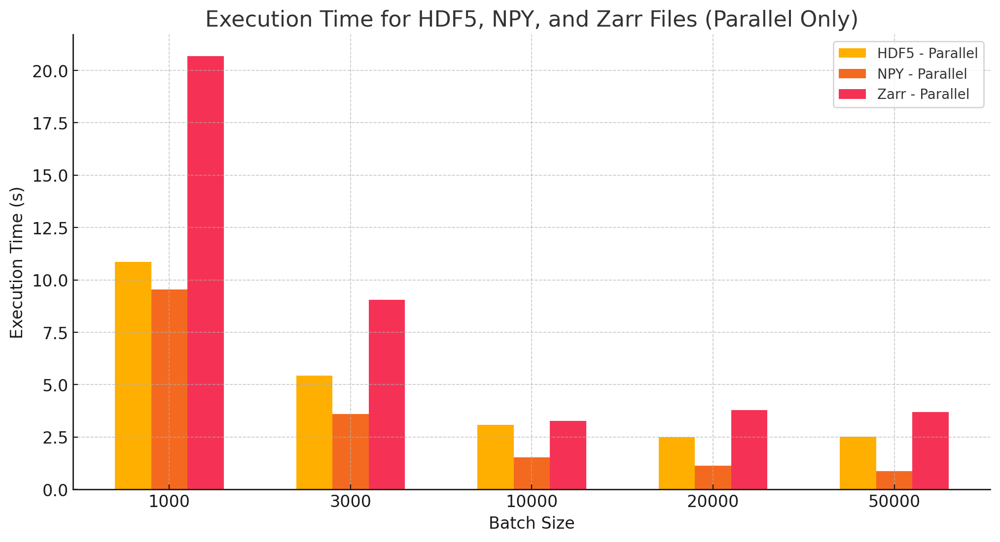

# Results/discussion about I/O 

## Main aspects influencing I/O performance
### File format 
Formats include npy, hdf5, zarr.
| Format    | Pros | Cons |
| -------- | ------- | ------- |
| npy      | Fastest to read                                                              | No compression                                    |
| hdf5     | Compression, chunking, allows creating in an incremental way                 | Paralle read with MPI needs special config on HPC |
| zarr     | Compression, chunking, allows creating in an incremental way, parallel read  | Creates many files (chunks)                       |

Tests with synthetic data on local machine

**Conclusion**: We chose hdf5

 ### Chunk size
 Since we are processing the data in batches, each batch only needs to read part of the data. We slice the data such as: *h5_file[:, :, start:end]*.

 We measured execution time with distinct chunks:
 - (n_time, n_bands, 1000)
 - (n_time, n_bands, 1)
 - (1, n_bands, 1000)

*This was tested with real-world data (5k pixels from the T29SPB tile - shape of array (798, 4, 5000))*

**Conclusion**: There was no significant difference in processing time. We chose to move forward with chunk (n_time, n_bands, 1)

### Compression
We tested if hdf5 compression could influence runtimes due to slower readings.

We compress the hdf5 file using **lzf** (provides fastest read) for the spectro-temporal values and **gzip** for the xs and ys.

We tested with real-world data (5k pixels from the T29SPB tile - shape of array (798, 4, 5000)).

**Conclusion**: There was no significant difference in processing time when using compressed/uncompressed hdf5 files.

## Issues to address
We have to confirm if hdf5 parallel read in the HPC with MPI is working properly.

 
