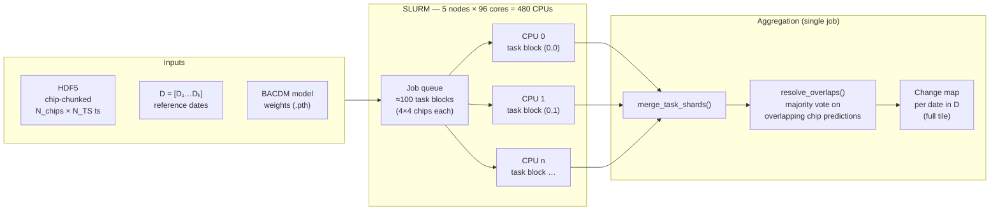
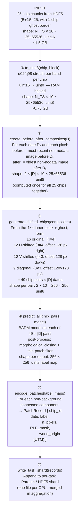
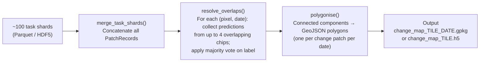

Prompt: Going back to the chip processing in HPC. I pasted your suggestions to https://github.com/S2change/vegetation_loss/tree/main/scripts/data_exploration/HPC_parallelization. But I need some more detail for what each task will perform. I don't want the full code but just the main steps and functions that will be defined later. It would be great to represent this "pseudo-code" graphically so I can discuss it with my collaborators.
The input is a chip-chuncked hdf5 file, with possibly N_TS=48 time stamps. I want to use 5 nodes with 96 cores each.
Form what we discussed bedore, each task takes, say 16 chips (4*4 spatial arrangement) and do teh following steps:
1) (optional) chips are read in 16-bits but will be converted to 8-bits before model prediction. The conversion is based on the q02 and q98 of each band and each chip (as in @scripts/bacdm/data/dataset_swin_GZ.py (function _to_uint8). This convertion could be the first step to reduce memory use; THhs can be a function "to_int8" that takes the inputs for the task and replaces them with a int8 version in memory
3) For a D=list of dates to be given as input (that fit into the range of N_TS=48 timesteps) "before" and "after" time composites must be computed for each of those dates. A time composite for a certain date D[k] is basically the closest image "before" or "after". But because of NoData pixels the function gets more complicated. For the time being, this would be a function "create_before_after_time_composites(list_of_dates)". We will se later how to optimize this but I was thinking this would be done a single time for all 16 original chips together, since the dates will be the same for all chips.
5) Create all 49(=16+12+12+9) 256*256 pairs of "before"/"after" (including original chips and shifted chips) and apply the prediction model to each pair of time composites "before"/"after"  as in @scripts/bacdm/predict.py  . The output will store the predicted chenged pixels (excluding backgruond) for all 49*len(D) applications of the predicted model. Each record should have indices [i,j] of the pixel, label (1="Cuts" or 2="Fries"); and data D[k]. If there is a large patch os pixels, perhaps there is a better encoding of the patch than listing all of its pixels.
Finally, the outputs of all the tasks should be aggregated. The final goal is to gather all change predictions for all dates in D for the whole Sentinel-2 tile from the information available in the N_TS timestamps of the input


## HPC inference pipeline — architecture and pseudo-code

### 1. System overview



---

### 2. Per-task pipeline (one CPU, one 4×4 chip block)



---

### 3. Chip block geometry — how 49 chips arise from a 4×4 block

```
Ghost border (□) + inner block (■) loaded per task

  □ □ □ □ □ □
  □ ■ ■ ■ ■ □    ← (B+1)² = 5×5 = 25 chip areas loaded
  □ ■ ■ ■ ■ □
  □ ■ ■ ■ ■ □
  □ ■ ■ ■ ■ □
  □ □ □ □ □ □

Sub-grid            Count   Pixels used
─────────────────────────────────────────────────────────
Original (4×4)         16   full chip
H-shifted (3×4)        12   right 128 px of col i  +  left 128 px of col i+1
V-shifted (4×3)        12   bottom 128 px of row j  +  top 128 px of row j+1
Diagonal  (3×3)         9   one quadrant from each of 4 neighbouring chips
─────────────────────────────────────────────────────────
Total                  49   chip pairs × |D| dates
```

---

### 4. Function signatures (pseudo-code)

```python
def load_chip_block(hdf5, chip_block_id, B=4) -> ndarray:
    """
    Read (B+1)² chip chunks from the HDF5 (including 1-chip ghost border).
    Returns uint16 array of shape (N_TS, 10, (B+1)²×65536).
    """

def to_uint8(chip_block: uint16) -> uint8:
    """
    Per-band, per-chip q02/q98 stretch  (mirrors dataset_swin_GZ._to_uint8).
    NoData (65535) → 255.  Halves peak RAM.
    Returns uint8 array of same shape.
    """

def create_before_after_composites(chip_block: uint8, dates: list[date],
                                   ts_ordinals: ndarray) -> ndarray:
    """
    For every date Dₖ in dates and every pixel, select:
      before[k, pixel] = value from the most-recent timestamp ≤ Dₖ
                         with a valid (non-255) observation
      after [k, pixel] = value from the earliest timestamp ≥ Dₖ
                         with a valid observation
    Returns shape (2, |D|, 10, n_chip_pixels) uint8.
    Computed once for all chips in the block.
    """

def generate_shifted_chips(composites: ndarray, B=4) -> list[ChipPair]:
    """
    Slice the 25-chip block into 49 × |D| chip pairs of shape
    (2, |D|, 10, 256, 256): 16 original + 12 H + 12 V + 9 diagonal.
    Returns a list of ChipPair(before, after, chip_id, world_origin).
    """

def predict_all(chip_pairs: list[ChipPair], model) -> list[LabelMap]:
    """
    Run BACDM model on each ChipPair (before/after 256×256×10 uint8).
    Applies morphological closing + minimum-patch filter (mirrors predict.py).
    Returns list of LabelMap(labels 256×256 uint8, chip_id, date).
    """

def encode_patches(label_maps: list[LabelMap]) -> list[PatchRecord]:
    """
    For each non-background connected component in each label map:
      PatchRecord(
        chip_block_id,  chip_id,    date,
        label,          n_pixels,
        rle_mask,       world_origin_utm,
      )
    For large compact patches (after morphological closing), RLE encoding
    is far more compact than listing individual pixel coordinates.
    Polygonisation (Cuts/Fires patches → GeoJSON) deferred to aggregation.
    """

def write_task_shard(records: list[PatchRecord], out_path: Path):
    """Write records to a per-CPU Parquet or HDF5 shard."""
```

---

### 5. Aggregation steps



---

### 6. Memory budget per CPU (5 GB limit)

| Stage | Array shape | dtype | Size |
|---|---|---|---|
| After `load_chip_block` | (48, 10, 25×65536) | uint16 | ~1.5 GB |
| After `to_uint8` | (48, 10, 25×65536) | uint8 | ~0.75 GB |
| Composites (2 before/after × \|D\| dates) | (2, \|D\|, 10, 25×65536) | uint8 | ~0.15 GB (\|D\|=10) |
| Model weights + activations | — | float32 | ~1.5 GB |
| **Peak total** | | | **~3.6 GB ✓** |

